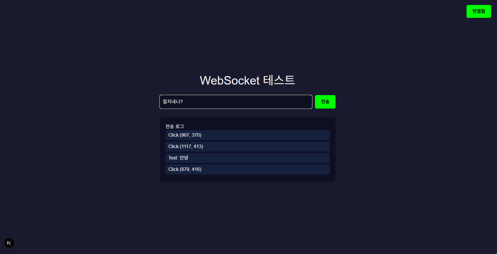

# 🪟 Windows WebSocket 파이프라인 실행 가이드

> **Next.js → Node.js → TouchDesigner**  
> Windows 10/11 | 초보자용 | 2025년 11월

---

## ✅ 시작 전 확인

```
□ Windows 10 이상
□ Node.js 20.x 이상 설치 필요
□ TouchDesigner 2023.10+ 설치 필요
```

---

## 📥 1. 프로젝트 다운로드

### 방법 1: Git Clone (추천)
```cmd
C:\> git clone https://github.com/devmyungduk/websocket-pipeline.git
C:\> cd websocket-pipeline
```

### 방법 2: ZIP 다운로드
1. https://github.com/devmyungduk/websocket-pipeline
2. 녹색 'Code' 버튼 클릭
3. 'Download ZIP' 선택
4. 압축 해제 → `C:\websocket-pipeline\`

---

## 🔧 2. Node.js 설치 (처음 한 번만)

### 2.1 다운로드
- https://nodejs.org
- "20.x LTS (Recommended)" 다운로드

### 2.2 설치 확인
```cmd
C:\> node --version
v22.11.0

C:\> npm --version
10.8.2
```

---

## 📦 3. 패키지 설치

### 3.1 WebSocket 서버 설치

**CMD 창 열기 → server 폴더 이동**

```cmd
C:\> cd websocket-pipeline\server
C:\websocket-pipeline\server> npm install
```

**성공 출력:**
```
added 1 package, and audited 2 packages in 2s
found 0 vulnerabilities
```

### 3.2 Next.js 클라이언트 설치

**새 CMD 창 열기 → client 폴더 이동**

```cmd
C:\> cd websocket-pipeline\client
C:\websocket-pipeline\client> npm install
```

**성공 출력:**
```
added XXX packages in XXs
```

---

## 🚀 4. 실행 순서

### ✅ 실행 전 체크리스트

```
□ Node.js 설치 완료
□ server 폴더에서 npm install 완료
□ client 폴더에서 npm install 완료
```

---

### 4.1 WebSocket 서버 실행 [CMD #1]

**위치:** `C:\websocket-pipeline\server`

```cmd
C:\websocket-pipeline\server> node server.js
```

**성공 출력:**
```
━━━━━━━━━━━━━━━━━━━━━━━━━━━
WebSocket 서버 시작
주소: ws://localhost:8080
━━━━━━━━━━━━━━━━━━━━━━━━━━━
```

> ⚠️ **이 창을 닫지 마세요!** 서버가 계속 실행되어야 합니다.

---

### 4.2 Next.js 클라이언트 실행 [CMD #2]

**새 CMD 창 열기**

**위치:** `C:\websocket-pipeline\client`

```cmd
C:\websocket-pipeline\client> npm run dev
```

**성공 출력:**
```
  ▲ Next.js 16.0.1 (Turbopack)
  - Local:        http://localhost:3000
  - Network:      http://172.30.1.79:3000

 ✓ Starting...
 ✓ Ready in 2s
```

---

### 4.3 브라우저 테스트

1. **브라우저 열기:** http://localhost:3000
2. **연결 확인:** 우측 상단 녹색 "연결됨" 표시
3. **테스트:**
   - 화면 클릭 → 전송 로그 확인
   - 키보드 입력 → 전송 로그 확인

**클라이언트 화면:**




## 🎨 5. TouchDesigner 연결

### 5.1 WebSocket DAT 추가

1. TouchDesigner 실행
2. 빈 공간 우클릭
3. **Add Operator → DAT → WebSocket**

### 5.2 Parameters 설정

| Parameter | 값 |
|-----------|-----|
| **Active** | ✅ ON |
| **Network Address** | `localhost` |
| **Network Port** | `8080` |
| **Auto Reconnect** | ✅ ON |

> ⚠️ **중요:** Network Address에 `ws://` 또는 포트 번호 포함하지 않습니다!
> 
> ❌ 잘못된 예: `ws://localhost:8080`  
> ✅ 올바른 예: `localhost` (포트는 별도 입력)

### 5.3 데이터 확인

**WebSocket DAT 더블클릭:**

```json
{"type":"click","x":512,"y":384,"time":"15:30:45"}
{"type":"keydown","key":"a","time":"15:30:50"}
```

---

## 📂 프로젝트 구조

```
C:\websocket-pipeline\
│
├── 📄 .gitignore              ← Git 제외 파일
├── 📄 README.md               ← 이 파일
│
├── 📁 server\                 ← WebSocket 서버
│   ├── 📄 server.js
│   ├── 📄 package.json
│   └── 📁 node_modules\       ← npm install 시 자동생성
│
└── 📁 client\                 ← Next.js 클라이언트 (TypeScript)
    ├── 📁 .next\              ← npm run dev 시 자동생성
    ├── 📁 app\
    │   ├── 📄 page.tsx        ← WebSocket 송신 코드
    │   ├── 📄 layout.tsx
    │   ├── 📄 globals.css
    │   └── 📄 favicon.ico
    │
    ├── 📁 node_modules\       ← npm install 시 자동생성
    ├── 📁 public\
    │   └── *.svg
    │
    ├── 📄 .gitignore
    ├── 📄 eslint.config.mjs
    ├── 📄 next.config.ts
    ├── 📄 next-env.d.ts       ← Next.js 실행 시 자동생성
    ├── 📄 package.json
    ├── 📄 postcss.config.mjs
    └── 📄 tsconfig.json
```

**주요 코드 파일:**
- [`server/server.js`](./server/server.js) - WebSocket 서버
- [`client/app/page.tsx`](./client/app/page.tsx) - Next.js 클라이언트

---

## ❌ 오류 해결

### "Cannot find module 'ws'"

**원인:** server 폴더에서 npm install 안 함

**해결:**
```cmd
C:\websocket-pipeline\server> npm install
```

---

### "EADDRINUSE" (포트 사용 중)

**해결 1: 실행 중인 프로세스 종료**
```cmd
C:\> netstat -ano | findstr :8080
  TCP    0.0.0.0:8080    LISTENING    1234

C:\> taskkill /PID 1234 /F
```

**해결 2: 다른 포트 사용**
1. `server/server.js` 수정:
   ```javascript
   const server = new WebSocket.Server({ port: 8081 });
   ```
2. `client/app/page.tsx` 수정:
   ```javascript
   new WebSocket('ws://localhost:8081');
   ```
3. TouchDesigner 포트 변경: `8081`

---

### TouchDesigner 연결 실패

**체크리스트:**
```
□ [CMD #1] server.js 실행 중?
□ Active 파라미터 ON?
□ Network Address: localhost (ws:// 없이)
□ Network Port: 8080
□ 방화벽 차단 확인
```

**방화벽 해제 (관리자 CMD):**
```cmd
netsh advfirewall firewall add rule name="WebSocket" dir=in action=allow protocol=TCP localport=8080
```

---

## 🔄 실행 흐름도

```
[CMD #1] node server.js
    ↓
WebSocket 서버 시작 (포트 8080)
    ↓
[CMD #2] npm run dev
    ↓
Next.js 시작 (포트 3000)
    ↓
브라우저: http://localhost:3000
    ↓
클릭/키 입력 → WebSocket 전송
    ↓
TouchDesigner: WebSocket DAT에서 수신
```

---

## 🛑 종료 방법

1. **브라우저 닫기**
2. **[CMD #2]** `Ctrl + C` (Next.js 종료)
3. **[CMD #1]** `Ctrl + C` (서버 종료)

---

## 📚 추가 리소스

| 항목 | URL |
| --- | --- |
| Node.js | https://nodejs.org/docs |
| Next.js | https://nextjs.org/docs |
| TouchDesigner | https://docs.derivative.ca |
| WebSocket (ws) | https://www.npmjs.com/package/ws |
| TypeScript | https://www.typescriptlang.org/docs |

---

## ✅ 빠른 시작 요약

```cmd
# 1. 프로젝트 다운로드
git clone https://github.com/devmyungduk/websocket-pipeline.git
cd websocket-pipeline

# 2. 패키지 설치
cd server
npm install
cd ..\client
npm install

# 3. 실행
# CMD #1
cd ..\server
node server.js

# CMD #2 (새 창)
cd websocket-pipeline\client
npm run dev

# 4. 브라우저: http://localhost:3000
# 5. TouchDesigner: WebSocket DAT 설정
```

---

**작성일:** 2025년 11월  
**환경:** Windows 10/11 검증 완료  
**기술 스택:** Node.js + Next.js 16 (TypeScript) + TouchDesigner  
**최종 업데이트:** 2025-11-05 (프로젝트 구조 개선)
